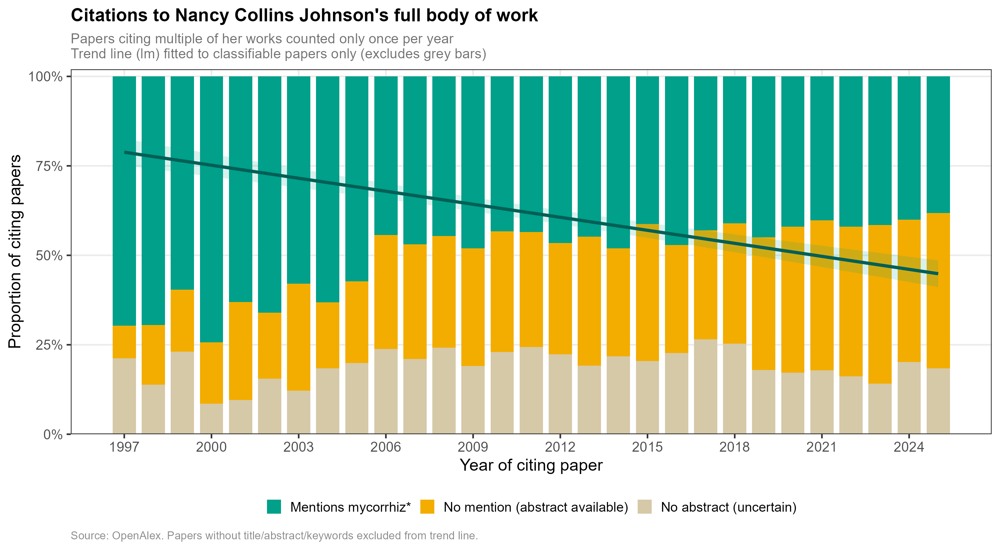

# nancy_citations

Citation analysis for Johnson, Graham & Smith (1997) and the full body of work by Nancy Collins Johnson, investigating whether her work is cited beyond the mycorrhizal literature over time.

## What this does

1. **`mycorrhiz_citation_analysis.py`** — Fetches all papers citing Johnson, Graham & Smith (1997) via the [OpenAlex](https://openalex.org) API, retrieves titles, abstracts, and keywords for each, and searches for the string `mycorrhiz` (capturing mycorrhiza, mycorrhizal, mycorrhizae, etc.). Outputs `mycorrhiz_citation_results.csv`.

2. **`patch_missing_abstracts.py`** — For papers where OpenAlex had no abstract, queries the [Semantic Scholar](https://www.semanticscholar.org) batch API to fill in any available abstracts and re-runs the search. Updates the CSV in place.

3. **`nancy_johnson_citation_analysis.py`** — Extends the analysis to Nancy Collins Johnson's full body of work (156 papers, ~12,000 total citations). Outputs `nancy_johnson_citation_results.csv` with one row per citing-paper/cited-work pair.

4. **`plot_mycorrhiz_trends.R`** — Produces stacked bar charts showing the proportion of citing papers mentioning mycorrhiz* by year, with a linear trend line. Also runs logistic regression (on individual papers) and weighted linear regression (on annual proportions) to test whether the trend over time is statistically significant.

## Key finding

Citations to Nancy Johnson's work have become significantly less mycorrhizal over time, suggesting her frameworks (especially the mutualism–parasitism continuum from the 1997 paper) are increasingly being applied in non-mycorrhizal contexts.



## Requirements

**Python scripts:**
```
python -m pip install requests
```

**R script:**
```r
install.packages(c("tidyverse", "scales"))
```

## Usage

```bash
python mycorrhiz_citation_analysis.py
python patch_missing_abstracts.py
python nancy_johnson_citation_analysis.py
```

Then open `plot_mycorrhiz_trends.R` in your favorite way to look at code and run it.

## Data sources

- [OpenAlex](https://openalex.org) — primary source for citation index, abstracts, and keywords
- [Semantic Scholar](https://www.semanticscholar.org) — secondary abstract retrieval for paywalled papers
